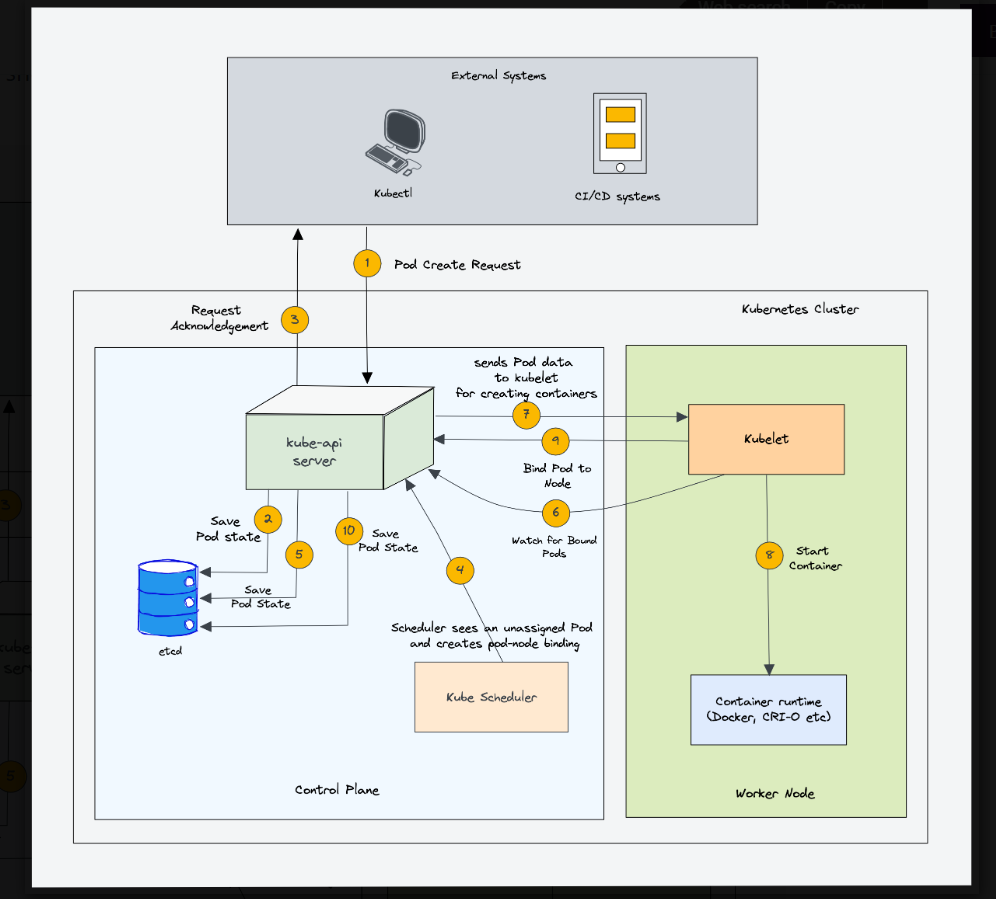
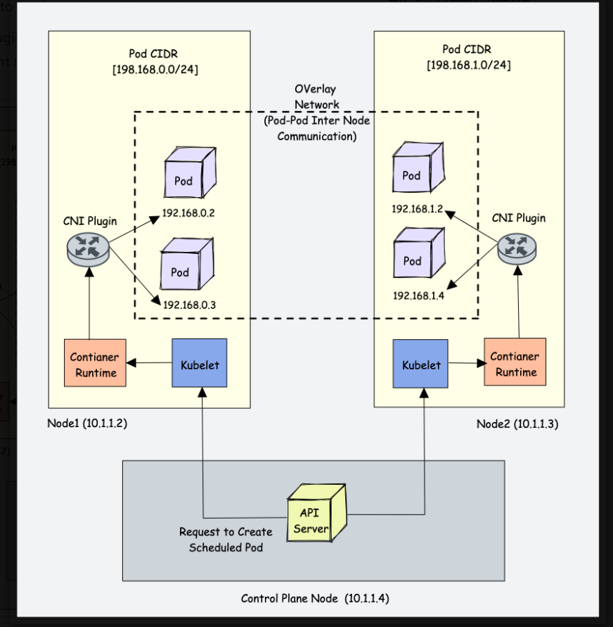

# devops_kubernetes

The following Kubernetes architecture diagram shows all the components of the Kubernetes cluster and how external systems connect to the Kubernetes cluster.


The following image shows a high-level overview of how the scheduler works



CNI Plugin enables networking between pods spread across the same or different nodes using an overlay network
Following are high-level functionalities provided by CNI plugins.

1- Pod Networking
2- Pod network security & isolation using Network Policies to control the traffic flow between pods and between namespaces

Some popular CNI plugins include:

Calico
Flannel
Weave Net
Cilium (Uses eBPF)
Amazon VPC CNI (For AWS VPC)
Azure CNI (For Azure Virtual network)Kubernetes networking is a big topic and it differs based on the hosting platforms.

When it comes to networking, the following Kubernetes objects plays a key role.

Services
Ingress
Network policies.




# Essential Kubernetes Commands for DevOps Engineers

This article will help in understanding the most important and commonly used Kubernetes commands required for a DevOps Engineer. By mastering these commands, you’ll be equipped to navigate and control Kubernetes clusters effortlessly.

## Prerequisites
To run these commands, use a Kubernetes cluster or an online cluster, and ensure `kubectl` is installed.

---

### Fetch kubectl version
Check the client and server version of kubectl.
```bash
kubectl version
```

### Get Cluster details
Gather important details about the Kubernetes cluster.
```bash
kubectl cluster-info
```

### Listing Available Kubernetes API Resources
List all top-level API resources available on the cluster's API server.
```bash
kubectl api-resources
```

### Retrieving Kubernetes Contexts
List all available contexts (clusters, users, and namespaces) in your kubeconfig file.
```bash
kubectl config get-contexts
```

### Switch Clusters
Switch between different contexts/clusters. This is useful for managing multiple Kubernetes environments.
```bash
kubectl config use-context <context_name>
```

### Switch/Default Namespace Context
Set or change a context in your Kubernetes configuration to manage multiple namespaces.
```bash
kubectl config set-context --current --namespace <NAMESPACE_NAME>
```

### kubectl apply
Create or update Kubernetes resources using YAML configuration files.
```bash
kubectl apply -f <file_path>
```

### Create Resources Using Kubectl
Create a new resource. For example, create a namespace:
```bash
kubectl create namespace <namespace_name>
```

### Patching Kubernetes Resources
Modify the attributes of a resource using strategic merge patch, JSON merge patch, or JSON patch.
```bash
kubectl patch (-f FILENAME | TYPE NAME) [-p PATCH|--patch-file FILE]
```

Example:
```bash
kubectl patch node k8s-node-1 -p '{"spec":{"unschedulable":true}}'
```

### List Any Resources
List all resources in the current namespace.
```bash
kubectl get deploy -n kube-system
```

### Manage Deployment
Manage rollouts and updates for deployments.
```bash
kubectl rollout status deployment/<deployment_name>
```

### Describe Pod
Get detailed information about a specific pod.
```bash
kubectl describe pod <pod_name> -n <NAMESPACE>
```

### Stream Logs
Retrieve logs from a running container.
```bash
kubectl logs <pod_name> <container_name> -f
```

### Execute Command in Pod
Execute commands directly inside a container.
```bash
kubectl exec -it <pod_name> -c <container_name> -- /bin/sh
```

### Scale Replicas
Scale the number of replicas for a deployment, replication controller, or stateful set.
```bash
kubectl scale deployment <deployment_name> --replicas=3
```

### Expose Kubernetes Resources
Expose a deployment, replica set, or pod as a service.
```bash
kubectl expose deployment <deployment_name> --type=NodePort --port=<port_number>
```

### Delete Kubernetes Resources
Delete a resource defined in a YAML file or directly by name.
```bash
kubectl delete pod <pod_name>
```

### Setting Node Taints in Kubernetes
Add a taint to a node to restrict pod scheduling.
```bash
kubectl taint nodes <node_name> key=value:taint_effect
```

### Marking a Node as Unschedulable
Indicate a node is unavailable for scheduling.
```bash
kubectl cordon NODE
```

### Mark Node as Schedulable
Mark a previously unschedulable node as available.
```bash
kubectl uncordon NODE
```

### Draining a Kubernetes Node
Drain a node of all running pods, with various force and grace period options.
```bash
kubectl drain <node_name> --force
```

### Explain Resources
Get documentation for Kubernetes manifests.
```bash
kubectl explain pods
```

### List Events
List events sorted by creation timestamp.
```bash
kubectl get events --sort-by=.metadata.creationTimestamp
```

### Comparing Resource Configurations
Compare the current state of the cluster with a manifest.
```bash
kubectl diff -f ./my-manifest.yaml
```

### Set Configuring Resources
Perform rolling updates on containers, such as updating the image.
```bash
kubectl set image deployment/frontend www=image:v2
```

### Replacing Resources
Forcefully replace, delete, and re-create resources.
```bash
kubectl replace --force -f ./pod.json
```

### Manage Labels
Modify labels on resources.
```bash
kubectl label pods my-pod new-label=awesome       # Add a Label
kubectl label pods my-pod new-label-              # Remove a Label
kubectl label pods my-pod new-label=new-value --overwrite  # Overwrite Label
```

### Editing Resources
Edit any API resource.
```bash
kubectl edit svc/docker-registry
KUBE_EDITOR="nano" kubectl edit svc/docker-registry
```

### Debug Resources
Start an interactive debugging session with a pod or node.
```bash
kubectl debug my-pod -it --image=busybox:1.28
```

### Running a Pod
Run a pod as an interactive shell.
```bash
kubectl run -i --tty busybox --image=busybox:1.28 -- sh
```

### Copying Files/Directories to and from Containers
Copy files to and from a container in a pod.
```bash
kubectl cp /tmp/foo_dir my-pod:/tmp/bar_dir
```

### Forwarding Ports to Kubernetes Pods
Forward a local port to a pod's port.
```bash
kubectl port-forward <pod-name> <local-port>:<pod-port>
```

### Viewing Resource Metrics in Kubernetes
Get resource consumption metrics for nodes, pods, containers, or services.
```bash
kubectl top [node | pod | container | service] [NAME | -l label]
```

---

By mastering these `kubectl` commands, you can efficiently manage and troubleshoot Kubernetes clusters.

